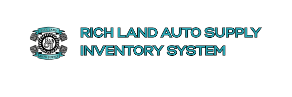

<div align="center">
  
</div>

<br>

> A full-featured **integrated operations system** for auto parts businesses, built with **Python**, **Django**, and **Bootstrap 5**. Track products, manage stock-in/stock-out transactions, view edit history, and generate PDF/CSV reports—all in one application.

Render Deployment Link: https://rich-land-inventory-system.onrender.com/
---

##  Team Members

| Name                      | GitHub Profile                                      |
|--------------------------|-----------------------------------------------------|
| Jhoram Narsico           | [github.com/jhoramnarsico](https://github.com/jhoramnarsico) |
| Joseph Ernest Alberto    | [github.com/Jepoyskies](https://github.com/Jepoyskies) |
| Jillian Athea Boc        | [github.com/Jillian-Athea](https://github.com/Jillian-Athea) |
| Ram Jay Po               | [github.com/FunkyAtoms](https://github.com/FunkyAtoms) |


---

##  Key Features

-  **Full CRUD** operations for products and categories  
-  **Stock tracking** with stock-in and stock-out transactions  
-  **Audit trail** for every product change (who changed what & when)  
-  **Export reports** as **PDF** (`xhtml2pdf`) or **CSV**  
-  **Responsive UI** with **Bootstrap 5**  
-  **RESTful API** with **Django REST Framework**  
-  **Interactive API docs** via **Swagger UI** (`drf-spectacular`)  
-  **Role-based access** and secure admin panel

---

## Technology Stack

### Backend
- **Language**: Python 3.8+  
- **Framework**: Django  
- **Database**: MySQL  
- **API**: Django REST Framework (DRF)

### Libraries
- `django-simple-history` → Audit logs  
- `drf-spectacular` → OpenAPI 3.0 documentation  
- `xhtml2pdf` → PDF report generation  
- `python-decouple` → Secure `.env` management  
- `PyMySQL` → MySQL database driver

### Frontend
- **Templates**: Django HTML  
- **Styling**: Bootstrap 5  
- **Interactivity**: Vanilla JavaScript + Bootstrap JS

---

##  Project Milestones (Completed )

###  Milestone 1 (Nov W1): Proposal & Design
- Defined `Product`, `Category`, `Transaction` models  
- Completed ITCC14 Doc (Chapters 1–2)  
- Drafted API endpoints

###  Milestone 2 (Nov W2): Core Backend
- Django + MySQL + DRF setup  
- Basic CRUD + Swagger UI at `/api/docs/`

###  Milestone 3 (Nov W3): Full API + Reporting
- Full CRUD with validation  
- Audit history + PDF reports  
- Seed data script added

###  Milestone 4 (Nov W4): Frontend + Admin
- Responsive dashboard with Bootstrap  
- Product list, detail, history, and reporting pages  
- Admin panel enhanced with developer links

###  Milestone 5 (Dec W1): Polishing
- Checking for bugs
- Documentation

###  Final (Dec W2): Demo Ready
- Using free tier of Render for deployment 
- Backup assets and slides completed

---
## Developer Setup Instructions

Follow these steps to get the project running.

### 1. Clone the Repository

Open your terminal or command prompt and clone the project from its GitHub repository.

```bash
# Replace <your-repository-url> with the actual URL from GitHub
git clone <your-repository-url>

# Navigate into the project directory
cd richland_inventory

```
### 2. Create and Activate a Virtual Environment
Using a virtual environment is highly recommended to isolate project dependencies.

```bash

# Step 1: Create the virtual environment
python -m venv venv
```

```bash
# Step 2: Activate the virtual environment using PowerShell
.\venv\Scripts\activate

```
```bash
#IF there is an error activating the virtual environment, input this
Set-ExecutionPolicy -Scope Process -ExecutionPolicy RemoteSigned
```
### 3. Install Required Packages

```bash
pip install -r requirements.txt

```
### 4. Set Up the MySQL Database

```bash
# Create a new database. We recommend using utf8mb4 for full Unicode support.
CREATE DATABASE richland_inventory_db CHARACTER SET utf8mb4 COLLATE utf8mb4_unicode_ci;

#Create a new user and grant it privileges on the new database. Replace 'your_password' with a secure password.
CREATE USER 'your_db_user'@'localhost' IDENTIFIED BY 'your_password';
GRANT ALL PRIVILEGES ON richland_inventory_db.* TO 'your_db_user'@'localhost';
FLUSH PRIVILEGES;

```
### 5. Creating a .env file.
In the same directory as your manage.py file (the root of your project), create a new file named .env.
```bash
# .env
# SECURITY WARNING: keep the secret key used in production secret!
# SECURITY WARNING: Generate your own secret key for production
SECRET_KEY='django-insecure-your-own-secret-key'

# Set to False in production!
DEBUG=True

# In production, set this to your domain names e.g., 'www.yourdomain.com,yourdomain.com'
ALLOWED_HOSTS='127.0.0.1,localhost'

# -- Database Configuration --
DB_NAME='richland_inventory_db'
DB_USER='your_mysql_username'
DB_PASSWORD='your_mysql_password'
DB_HOST='localhost'
DB_PORT='3306'

```

### 6. Apply Database Migrations
   
 ```bash
python manage.py makemigrations

python manage.py migrate
```
(NOTED: You only need to run migrations when your database schema is out of sync with your Django models.)

### 7. Create an Administrator Account

 ```bash
python manage.py createsuperuser
```

### 8. Start the Django Web Server

 ```bash
python manage.py runserver

```
### Testing the Application
 ```bash
python manage.py test inventory
```

 ```bash
python manage.py flush
```

 ```bash
python manage.py seed_data
```
